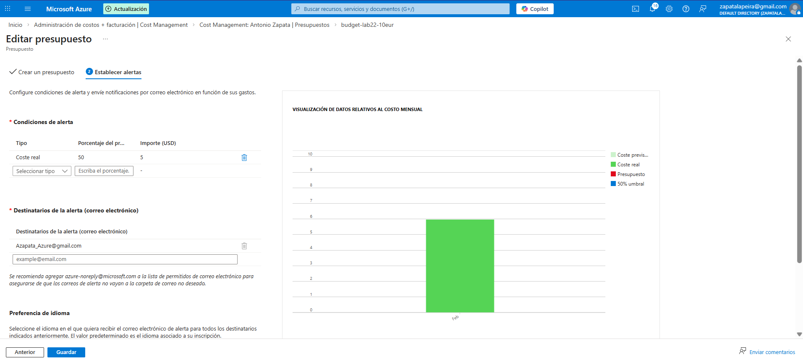
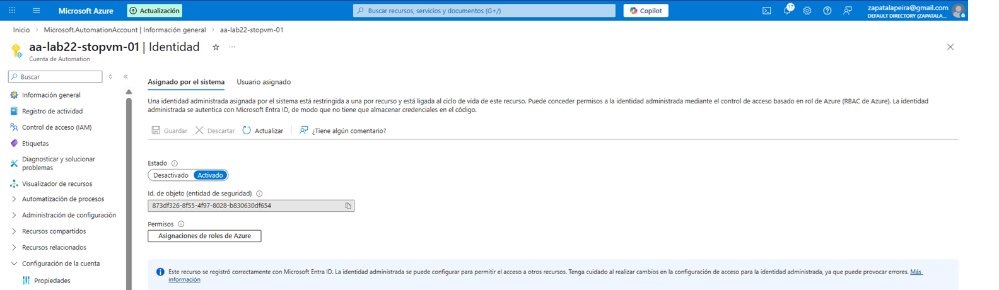
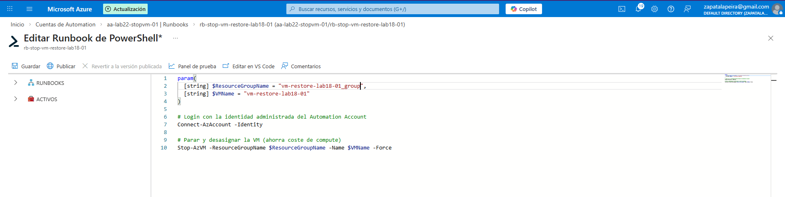
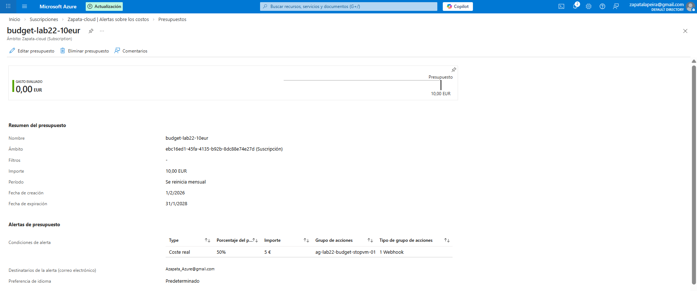
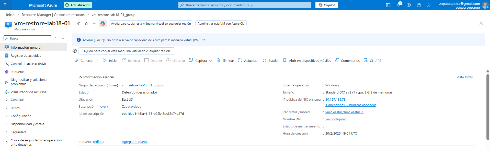

# Lab 22 – Cost Management: Budgets + Runbook (Stop VM por umbral)

## Objetivo
Tener control de costes en Azure con un presupuesto y alertas, y además dejar preparada una automatización para actuar cuando el gasto se acerca al límite.

En este caso, la acción automática es detener (desasignar) una máquina virtual de laboratorio para evitar costes inesperados.

---

## Qué he hecho en este laboratorio

1. He creado un presupuesto mensual (`budget-lab22-10eur`) con alerta al 50%.
2. He verificado que el presupuesto queda visible y con sus condiciones configuradas.
3. He creado un Automation Account con identidad administrada.
4. He creado y publicado un Runbook que detiene la VM `vm-restore-lab18-01`.
5. He creado un Action Group con un webhook que llama al Runbook.
6. He asociado ese Action Group al presupuesto para que, al dispararse la alerta, se ejecute la automatización.
7. He validado el Runbook manualmente comprobando que la VM queda “Detenida (desasignada)”.

---

## Arquitectura y concepto

Un Budget por sí solo no corta el gasto: sirve para monitorizar y avisar.  
Para que haya una acción correctiva, se conecta la alerta del budget a un Action Group, que a su vez ejecuta un Runbook mediante webhook.

Flujo:
Budget alert → Action Group → Webhook → Runbook → Stop/Deallocate VM

Esto es una aproximación práctica de gobernanza financiera en entornos dev/test o laboratorio.

---

## Configuración utilizada

- Presupuesto: `budget-lab22-10eur` (10 EUR mensual)
- Umbral: 50% (5 €) – Coste real
- Action Group: `ag-lab22-budget-stopvm-01` (Webhook)
- Automation Account: `aa-lab22-stopvm-01` (Managed Identity)
- Runbook: `rb-stop-vm-restore-lab18-01`
- VM objetivo: `vm-restore-lab18-01`
- Resource Group VM: `vm-restore-lab18-01_group`

Nota: las alertas de presupuesto no son instantáneas; pueden tardar en evaluarse.

---

## Evidencias

### 01 – Presupuesto creado y visible

---

### 02 – Alerta configurada (50%)

---

### 03 – Identidad administrada del Automation Account

---

### 04 – Runbook con script de parada de VM

---

### 06 – Action Group con webhook al Runbook

---

### 07 – Budget enlazado al Action Group

---

### 08 – VM detenida (desasignada) tras ejecutar el Runbook

---

## Checklist de verificación

- [x] Presupuesto creado y visible
- [x] Alerta configurada al 50%
- [x] Automation Account con identidad administrada
- [x] Runbook publicado
- [x] Action Group creado con webhook
- [x] Budget enlazado al Action Group
- [x] VM verificada en estado “Detenida (desasignada)”

---

## Qué le diría a un cliente o en entrevista

“Un budget no detiene el gasto por sí solo, pero sí puede disparar automatizaciones. Para entornos dev/test, conecto budgets a action groups que ejecutan runbooks y aplican acciones de ahorro, como parar recursos cuando el gasto se acerca al límite.”

---
